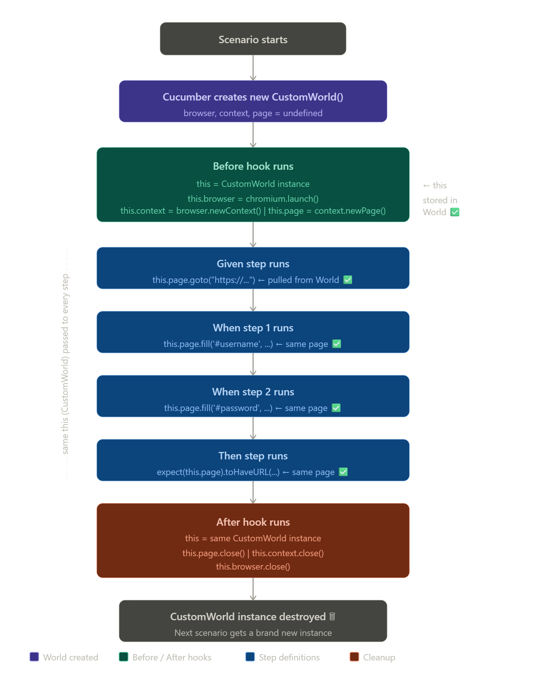

cucumber.js
     ↓
Load Feature Files
     ↓
Load Step Definitions
     ↓
Load Hooks
     ↓
Execute Before()
     ↓
Launch Browser
     ↓
Run Given
     ↓
Run When
     ↓
Run Then
     ↓
Execute After()
     ↓
Generate Reports
     ↓
Create rerun.txt

Before hook
  └── this.browser = chromium.launch()     ← stored in CustomWorld
  └── this.context = browser.newContext()  ← stored in CustomWorld
  └── this.page = context.newPage()        ← stored in CustomWorld
        │
        │  (same this passed to every step below)
        │
Given step
  └── this.page.goto(...)                  ← pulled from CustomWorld ✅

When step 1
  └── this.page.fill('#username', ...)     ← pulled from CustomWorld ✅

When step 2
  └── this.page.fill('#password', ...)     ← pulled from CustomWorld ✅

When step 3
  └── this.page.click(...)                 ← pulled from CustomWorld ✅

Then step
  └── expect(this.page).toHaveURL(...)     ← pulled from CustomWorld ✅

After hook
  └── this.page.close()                    ← same page, now closing ✅
  └── this.context.close()
  └── this.browser.close()

  

  Key Takeaways from the Flow
One scenario = one lifetime of CustomWorld. It's born when the scenario starts and destroyed when it ends.

this is the thread that connects every hook and step — it's always pointing to that same CustomWorld instance, so this.page set in Before is the exact same page object used in every Given, When, and Then.
After hook is cleanup — it closes everything that was opened in Before, using the same this.page, this.context, and this.browser.
Next scenario = fresh start — a brand new CustomWorld with empty properties, so no test data ever leaks between scenarios.

BeforeAll  → browser = chromium.launch()  (once, shared across all scenarios)
               │
               ├── Scenario 1
               │     Before  → this.Context = browser.newContext()
               │               this.Page    = Context.newPage()
               │     Steps   → this.Page.goto() / click() / fill()
               │     After   → this.Page.close() / this.Context.close()
               │
               ├── Scenario 2
               │     Before  → brand new Context + Page ✅
               │     Steps   → ...
               │     After   → close Context + Page
               │
AfterAll   → browser.close()  (once, after everything)

┌──────────────────────────────────────────────────────────┐
│ Cucumber Step Timeout: setDefaultTimeout(60000)          │ 60 seconds
│  ┌────────────────────────────────────────────────────┐  │
│  │ Playwright Action Timeout: page.setDefaultTimeout(15000)│ 15 seconds
│  └────────────────────────────────────────────────────┘  │
└──────────────────────────────────────────────────────────┘

$env:PWDEBUG=1 // enable playwright debug inspector
Remove-Item Env:PWDEBUG //  disable playwright debug inspector

Run All features without path in config:

npx cucumber-js src/features/**/*.feature --config config/cucumber.js

npx cucumber-js --config config/cucumber.js src/features/02_Login.feature

npx cucumber-js src/features/**/*.feature --config config/cucumber.js --tags "@Smoke" 
